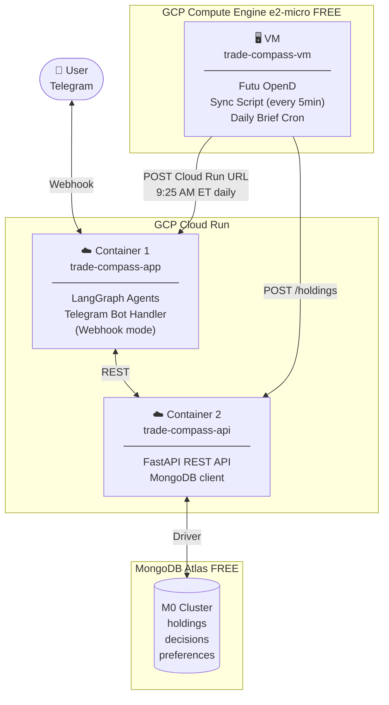
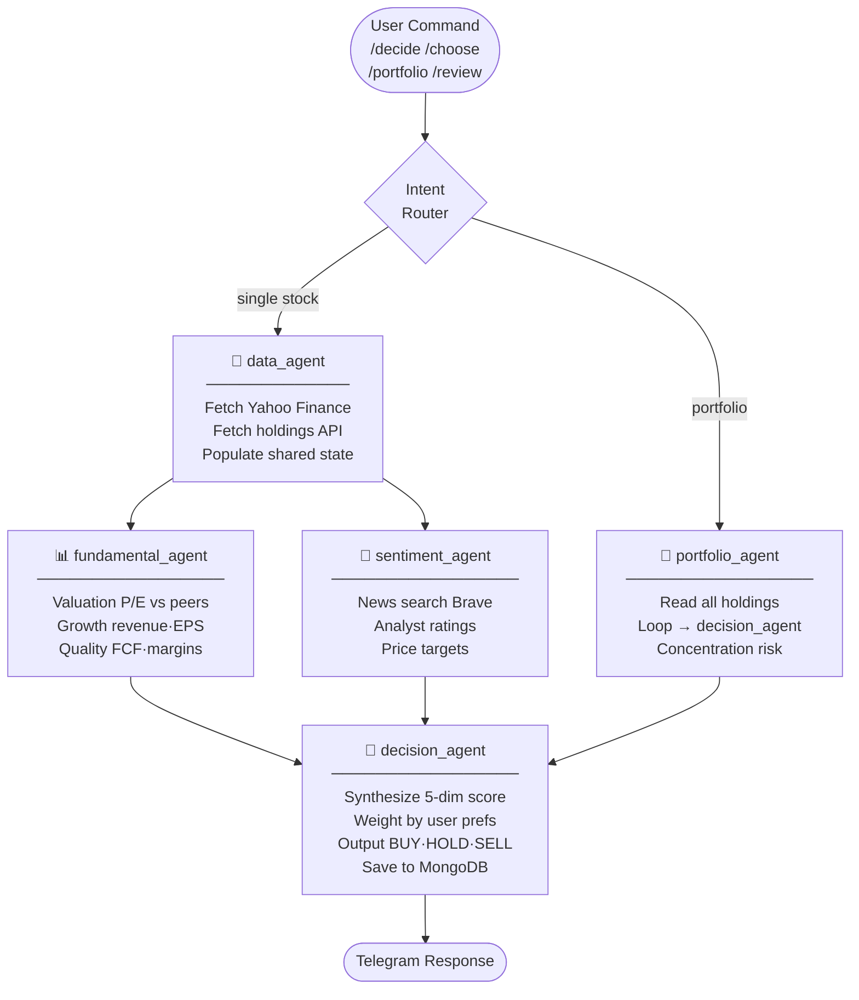
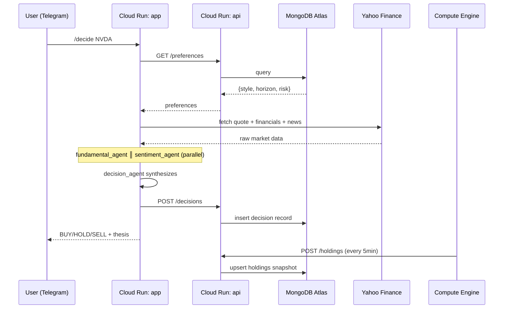

# trade-compass
## System Design Document

---

## 1. Overview

trade-compass is a personal US stock investment decision assistant. It connects to the user's Futu brokerage account, fetches real-time holdings, and uses a LangGraph multi-agent AI system to deliver clear, actionable verdicts: **Buy, Hold, or Sell** — with full reasoning.

Users interact exclusively through **Telegram**.

---

## 2. Infrastructure Architecture



**Summary:**
- **2 Cloud Run containers** — app (AI + Telegram) and api (data layer)
- **1 Compute Engine VM** — Futu sync + cron (free tier, us-west1)
- **1 MongoDB Atlas cluster** — free tier M0

---

## 3. AI Agent Architecture



**5 nodes total:**

| Node | Runs | Parallel |
|------|------|----------|
| `data_agent` | Fetch market data + holdings | — |
| `fundamental_agent` | Valuation / Growth / Quality | ✅ with sentiment |
| `sentiment_agent` | News / Analyst ratings | ✅ with fundamental |
| `decision_agent` | Synthesize → BUY/HOLD/SELL | — |
| `portfolio_agent` | Loop holdings → decision_agent | — |

Routing logic lives in **conditional edges**, not a separate node.

---

## 4. Data Flow



---

## 5. Five-Dimension Scorecard

Every analysis runs through the same framework. Weights adjust based on user preferences.

| Dimension | Agent | Data Source |
|-----------|-------|-------------|
| Valuation | fundamental_agent | Yahoo Finance (P/E, EV/EBITDA) |
| Growth | fundamental_agent | Yahoo Finance Financials |
| Quality | fundamental_agent | Yahoo Finance / SEC EDGAR |
| Sentiment | sentiment_agent | Brave Search / Yahoo Finance |
| Timing | sentiment_agent | Yahoo Finance (52w range, trend) |

---

## 6. REST API Endpoints

| Method | Endpoint | Caller | Purpose |
|--------|----------|--------|---------|
| GET | `/holdings` | data_agent | Current Futu positions |
| POST | `/holdings` | Sync script | Push holdings snapshot |
| GET | `/decisions` | decision_agent | History for thesis tracking |
| POST | `/decisions` | decision_agent | Persist verdict |
| GET | `/preferences` | Orchestrator edge | User preferences |
| PUT | `/preferences` | One-time setup | Write preferences |

---

## 7. Data Models

### `holdings`
```json
{
  "synced_at": "2026-05-08T09:25:00Z",
  "positions": [
    {
      "ticker": "NVDA",
      "qty": 100,
      "cost_price": 650.00,
      "market_price": 892.00,
      "unrealized_pl": 24200.00,
      "unrealized_pl_ratio": 0.372
    }
  ]
}
```

### `decisions`
```json
{
  "ticker": "NVDA",
  "date": "2026-05-08",
  "verdict": "BUY",
  "confidence": "medium-high",
  "thesis": "Blackwell supply ramp + cloud capex upcycle",
  "key_assumptions": [
    "Blackwell shipments on track",
    "China export restrictions stabilize"
  ],
  "stop_loss": 820.00,
  "target_price": 1024.00
}
```

### `preferences`
```json
{
  "style": "growth",
  "horizon": "medium",
  "risk": "moderate"
}
```

---

## 8. Repository Structure

```
trade-compass/
  ├── app/                        # Cloud Run: LangGraph + Telegram bot
  │   ├── agents/
  │   │   ├── data.py
  │   │   ├── fundamental.py
  │   │   ├── sentiment.py
  │   │   ├── decision.py
  │   │   └── portfolio.py
  │   ├── graph/
  │   │   └── workflow.py         # LangGraph topology + conditional edges
  │   ├── tools/
  │   │   ├── market_data.py      # Yahoo Finance fetch tools
  │   │   └── portfolio_api.py    # REST API client
  │   ├── telegram/
  │   │   └── bot.py              # Webhook handler
  │   ├── Dockerfile
  │   └── main.py
  ├── api/                        # Cloud Run: FastAPI REST API
  │   ├── routes/
  │   ├── models/
  │   ├── Dockerfile
  │   └── main.py
  ├── sync/                       # Compute Engine: Futu sync script
  │   └── sync.py
  └── terraform/
      ├── bootstrap/              # GCS bucket for tfstate
      ├── compute_engine/         # e2-micro VM
      ├── atlas/                  # MongoDB Atlas M0
      └── cloud_run/              # Both Cloud Run services
```

---

## 9. Technology Stack

| Layer | Technology |
|-------|-----------|
| Agent orchestration | LangGraph |
| LLM connectors | LangChain (`langchain-anthropic`) |
| LLM | Claude Sonnet via OpenRouter |
| Telegram bot | python-telegram-bot (webhook mode) |
| REST API | FastAPI + Motor (async MongoDB driver) |
| Brokerage sync | futu-api (Python) |
| Database | MongoDB Atlas M0 (free) |
| Infrastructure | Terraform + GCP |

---

## 10. Cost Estimate

| Component | Cost |
|-----------|------|
| Cloud Run (app + api) | $0 — scale to zero, personal usage within free tier |
| Compute Engine e2-micro (us-west1) | $0 — GCP always-free tier |
| MongoDB Atlas M0 | $0 — free tier |
| GCS tfstate bucket | < $0.01/month |
| **Total** | **~$0/month** |
