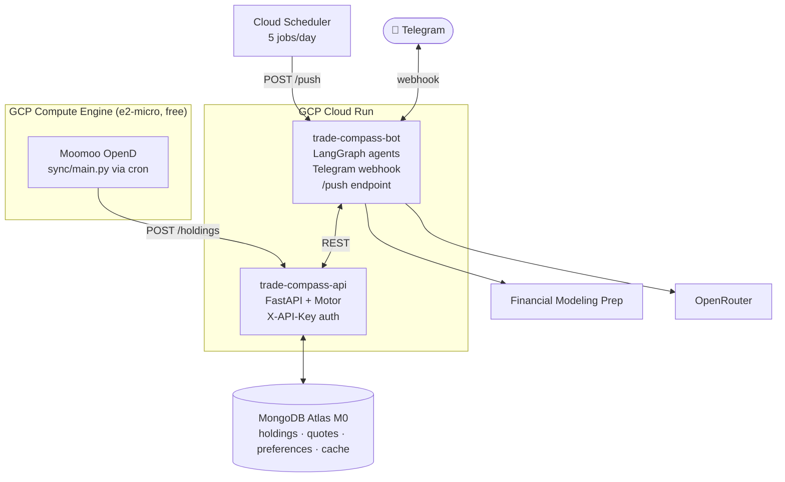
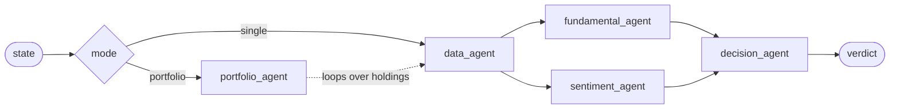

# trade-compass

[](https://github.com/PCBZ/trade-compass/actions/workflows/lint.yml)
[](https://www.python.org/)
[](https://langchain-ai.github.io/langgraph/)
[](https://fastapi.tiangolo.com/)
[](https://core.telegram.org/bots)
[](https://www.mongodb.com/atlas)
[](https://www.terraform.io/)
[](https://cloud.google.com/run)
[](LICENSE)

A personal US-equity research assistant. It syncs your Moomoo/Futu positions, runs them
through a LangGraph multi-agent pipeline, and delivers **BUY / HOLD / SELL** verdicts with
reasoning — straight to Telegram.

> **It does not place orders.** trade-compass is read-only against your brokerage: it
> fetches positions and produces analysis. Every trade stays a manual decision.
> Nothing here is investment advice.

---

## Architecture



Three deployable units, one database:

| Unit | Runs on | Responsibility |
|------|---------|----------------|
| [`bot/`](bot/) | Cloud Run | LangGraph agents, Telegram webhook, scheduled pushes |
| [`api/`](api/) | Cloud Run | FastAPI data layer over MongoDB (holdings, quotes, preferences, cache) |
| [`sync/`](sync/) | Compute Engine | Moomoo OpenD client, cron-driven position push |

All infrastructure is Terraform ([`terraform/`](terraform/)).

---

## How the analysis works



| Node | Does | LLM? |
|------|------|------|
| [`data_agent`](bot/src/agents/data.py) | Fetches 8 sources in parallel — 6 FMP endpoints plus holdings and preferences | — |
| [`fundamental_agent`](bot/src/agents/fundamental.py) | Organises valuation, YoY growth, quality ratios, Piotroski / Altman-Z | — |
| [`sentiment_agent`](bot/src/agents/sentiment.py) | Organises analyst targets, 52-week position, news headlines | — |
| [`decision_agent`](bot/src/agents/decision.py) | Synthesises everything into a structured verdict, persists to MongoDB | ✅ |
| [`portfolio_agent`](bot/src/agents/portfolio.py) | Runs the single-stock subgraph per holding, then scores concentration | — |

Two design choices worth knowing:

1. **Only `decision_agent` calls the LLM.** The fundamental and sentiment agents are
   plain Python — they compute derived metrics and shape context. One analysis costs
   exactly one LLM call.
2. **Objective anchors come from data, not the model.** Piotroski F-Score and Altman
   Z-Score are pulled pre-computed from FMP rather than inferred, and the verdict is
   forced through a Pydantic schema via `with_structured_output`.

Routing lives in conditional edges ([`graph/workflow.py`](bot/src/graph/workflow.py)),
not in a separate node. Two compiled graphs are exported: `single_stock_graph` (used
directly by `/decide` and reused by `portfolio_agent`) and `graph` (with intent routing).

---

## Telegram commands

| Command | Effect |
|---------|--------|
| `/decide TICKER` | Full analysis of one stock |
| `/portfolio` | Analyse every STOCK holding + concentration risk |
| `/model` | Inline keyboard to switch the analysis LLM |
| `/help`, `/start` | Command list |

### Scheduled pushes

Cloud Scheduler POSTs `{"type": ...}` to `/push`; the bot runs a portfolio sweep and
sends the result to `TELEGRAM_CHAT_ID`. Weekdays only.

| Type | ET | UTC cron |
|------|----|----------|
| `pre_market` | 9:25 AM | `25 13 * * 1-5` |
| `morning` | 11:00 AM | `0 15 * * 1-5` |
| `noon` | 12:30 PM | `30 16 * * 1-5` |
| `afternoon` | 2:30 PM | `30 18 * * 1-5` |
| `post_market` | 4:05 PM | `5 20 * * 1-5` |

Schedules are UTC-fixed, so they shift by an hour relative to ET across DST changes.

---

## REST API

All routes require an `X-API-Key` header. Interactive docs at `/docs`.

| Method | Path | Caller | Purpose |
|--------|------|--------|---------|
| `GET` | `/holdings` | bot | Current positions |
| `POST` | `/holdings` | sync | Replace the holdings snapshot |
| `GET` | `/quotes` | — | Full market snapshot |
| `GET` | `/quotes/{symbol}` | `data_agent` | Snapshot for one symbol |
| `POST` | `/quotes` | sync | Replace the snapshot |
| `GET` | `/preferences` | bot | Risk, sectors, position cap, model |
| `PUT` | `/preferences` | `/model` handler, setup | Update preferences |
| `GET` | `/cache` | bot | Read a cached upstream response |
| `PUT` | `/cache` | bot | Store a cached upstream response |
| `GET` | `/health` | Cloud Run | Liveness |

Models are defined in [`api/src/models.py`](api/src/models.py).

---

## Deployment

### Prerequisites

- A GCP project with billing enabled, plus `gcloud` and `terraform` on your machine
- A MongoDB Atlas account with an org ID and API key pair
- A Moomoo/Futu account with US market data (OpenD needs real credentials)
- API keys: [Telegram BotFather](https://t.me/botfather),
  [Financial Modeling Prep](https://site.financialmodelingprep.com/),
  [OpenRouter](https://openrouter.ai/)

### 1. Configure

```bash
cp .env.example .env   # set GCP_PROJECT_ID
```

Copy each `terraform.tfvars.example` to `terraform.tfvars` and fill in the values —
Atlas needs `atlas_public_key`, `atlas_private_key`, `atlas_org_id`, and `db_password`;
Compute Engine needs `ssh_allowed_ips`.

Put your own keys in `bot/.env` (`cp bot/.env.example bot/.env`). The deploy script
fills in `API_URL` and `API_KEY` for you and preserves anything already set, but
`FMP_API_KEY`, `OPENROUTER_API_KEY`, `TELEGRAM_BOT_TOKEN`, and `TELEGRAM_CHAT_ID` are
yours to supply. Get your chat ID by messaging [@userinfobot](https://t.me/userinfobot).

### 2. Deploy

```bash
cd terraform && ./deploy.sh
```

Eight ordered steps: tfstate bucket → VM (static IP first, so Atlas can allowlist it) →
Atlas cluster → API on Cloud Run → write `bot/.env` → VM again with the resolved
`api_url` → bot on Cloud Run → register the Telegram webhook. Cloud Run URLs and the
generated API key are printed at the end.

### 3. Finish the VM by hand

OpenD needs interactive credentials, so the VM bootstrap stops short of starting it:

```bash
gcloud compute ssh trade-compass-vm --zone us-west1-a
```

Then on the VM, edit `OpenD.xml` with your Moomoo login (the bootstrap log prints the
exact path), and:

```bash
sudo systemctl start moomoo-opend && sudo bash /opt/trade-compass/sync/setup_cron.sh
```

Cron then runs the sync every 5 minutes, 13:30–20:00 UTC, Mon–Fri.
Logs land in `/var/log/trade-compass-sync.log`.

---

## Local development

Each unit has its own requirements file and its own virtualenv.

```bash
python -m venv api/.venv && api/.venv/bin/pip install -r api/requirements-dev.txt
```

Run the API against a local or Atlas MongoDB:

```bash
cd api && API_KEY=dev MONGODB_URI=mongodb://localhost:27017 uvicorn src.main:app --reload
```

Run the bot (needs `bot/.env` populated):

```bash
cd bot && uvicorn src.main:app --reload --port 8081
```

Telegram delivers updates by webhook, so for local bot testing either expose port 8081
through a tunnel and re-register the webhook, or POST an update payload to `/webhook`
directly.

### Tests

```bash
cd api && pytest tests/ -v
```

`api/tests/` are unit tests against `mongomock-motor` and run in CI. `bot/tests/` are
**live integration tests** — they hit the real FMP, OpenRouter, and REST APIs and need a
populated `bot/.env`, so CI skips them. Run them by hand when you change a data source:

```bash
python -m pytest bot/tests/test_fmp.py -v
```

### Lint

CI ([`.github/workflows/lint.yml`](.github/workflows/lint.yml)) enforces `ruff check`
and `ruff format --check` across `api/src bot/src sync/src`, `terraform fmt` plus
`validate` on all four Terraform modules, and ShellCheck on `terraform/`.

---

## Configuration

### Environment

| Variable | Used by | Notes |
|----------|---------|-------|
| `GCP_PROJECT_ID` | `deploy.sh` | Root `.env` |
| `API_URL`, `API_KEY` | bot, sync | Written by `deploy.sh`; key stored in Secret Manager |
| `MONGODB_URI` | api | From the Atlas module |
| `FMP_API_KEY` | bot | Financial Modeling Prep |
| `OPENROUTER_API_KEY` | bot | OpenRouter |
| `TELEGRAM_BOT_TOKEN` | bot | BotFather |
| `TELEGRAM_CHAT_ID` | bot | Push destination |
| `OPEND_HOST`, `OPEND_PORT` | sync | Defaults `127.0.0.1:11111` |

### LLM models

Edit [`bot/src/config.json`](bot/src/config.json) to change the selectable models —
`id` must be a valid OpenRouter model slug, and exactly one entry should carry
`"default": true`. The list surfaces in `/model` automatically.

### Preferences

`risk_tolerance` (`low`/`medium`/`high`), `sectors`, `max_position_size` (fraction of
portfolio, default `0.1`), and `llm_model`. They feed the decision prompt and the
concentration-risk check. Set them with `PUT /preferences`.

---

## Limits and caveats

- **FMP free tier is 250 requests/day**, and `data_agent` spends 8 per ticker. A
  10-position `/portfolio` run costs ~80, so the five daily pushes alone exceed the quota.
  Requests degrade quietly — [`_get`](bot/src/tools/market_data.py) returns `[]` on 429,
  so the verdict silently loses inputs rather than erroring. Expect later pushes to be
  thinner unless you upgrade the plan, cache responses, or trim the schedule.
- **Cold starts.** Cloud Run scales to zero, so the first Telegram command after an idle
  period takes a few extra seconds.
- **The API is public with key-only auth.** Both Cloud Run services allow unauthenticated
  invocation; `X-API-Key` is the only barrier on the data layer. `/webhook` and `/push`
  on the bot are unauthenticated.
- **Free OpenRouter models are rate-limited** and occasionally return malformed
  structured output; `decision_agent` falls back to `INSUFFICIENT_DATA` when that happens.
- **Non-STOCK positions are skipped** by `/portfolio` — ETFs, funds, bonds, warrants, and
  futures are filtered out, though `/decide` on an ETF ticker still works via a
  fundamentals-free prompt path.

---

## License

Apache 2.0 — see [LICENSE](LICENSE).

For the original system design rationale, see [DESIGN.md](DESIGN.md).
